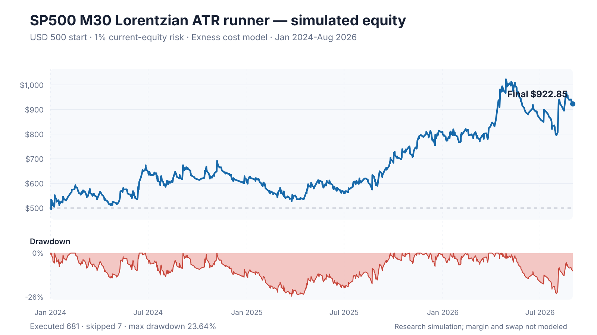
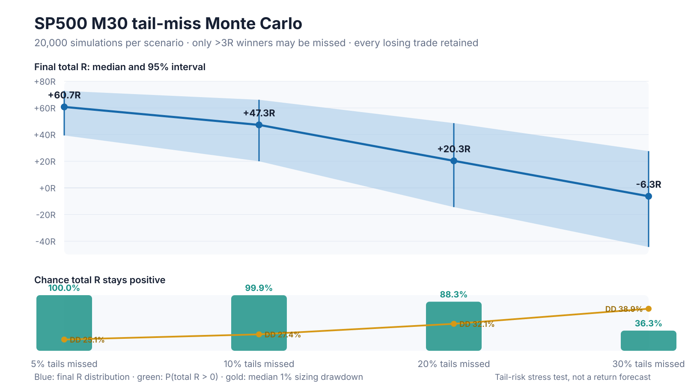

# Lorentzian Classifier Audit

Evidence-led, cost-aware audit of the open-source **Lorentzian Classification**
indicator on Exness US500 and XAUUSD data. The project started from a TradingView
claim, reconstructed the algorithm in Python, separated its classifier from its
filters, corrected target timing causally, compared it with simpler controls,
then tested lower timeframes, an ATR runner, small-account sizing and tail-risk
robustness.

> **Current status:** historical SP500 M30 runner candidate found, but the edge
> is **not confirmed**. It may continue as a frozen demo-forward experiment; it
> is not approved for live money. The original two-sided XAUUSD and cross-asset
> claims failed. On `research/xauusd-loss-diagnostics`, gold long-only is positive
> retrospectively, but incremental entry edge is unconfirmed. No new promotion.

## Executive conclusion

The Lorentzian classifier itself did **not** demonstrate a robust, transferable
edge. Lower timeframes increased activity but did not improve classifier quality.
Changing the exit to a convex ATR runner produced one interesting historical
pocket on SP500 M30:

- 688 candidate trades from January 2024 through August 2026;
- 4.94 trades per calendar week;
- `+72.77R`, mean `+0.106R/trade`, PF `1.172`;
- 38.5% win rate and `27.22R` strategy drawdown;
- all three annual blocks positive, but short trades contributed `-2.56R`;
- XAUUSD M30 remained negative at `-32.48R`, PF `0.927`;
- the SP500 result depends on repeatedly capturing large winners, not on a high
  win rate: 53 trades above `+3R` generated `+265.86R`, while every other trade
  combined generated about `-193.10R`;
- the first pristine September extension was `-3.92R` across only nine trades,
  which is negative but far too small to confirm or reject the edge.

The honest verdict is therefore:

`TAIL_STRUCTURE_SUPPORTED_EDGE_UNCONFIRMED`

## Same-feature model comparison: replacing the learner did not repair gold

The newest diagnostic freezes features, target, training eligibility and runner,
then compares Lorentzian, regularized logistic regression and an empirical
historical class prior. January 2024-August 2026 remains inspected history.

| XAUUSD M30 | Trades | Trades/week | Base R | Base PF | Stress R |
|---|---:|---:|---:|---:|---:|
| Original Lorentzian | 745 | 5.35 | -32.48 | 0.927 | -61.61 |
| Logistic regression | 207 | 1.49 | +4.59 | 1.038 | -5.85 |
| Same-pool class prior | 19 | 0.14 | +1.52 | 1.152 | +0.89 |

Logistic has lower probability error than the eight-neighbor fractions, but
slightly worse error than the feature-free prior, with an adjusted interval
excluding zero. Neither paired PnL improvement is statistically established.
Its 82 executed gold shorts have 40.24% label precision and lose -10.89R;
125 longs supply +15.49R. This is not a successful short-model repair.

With $3,000/1% and executable sizing, gold logistic finishes **$2,945.42** at
base costs and **$2,737.56** at stress costs. Two minimum-lot skips remove
about +4.50R of hypothetical winners. On SP500, logistic loses -6.52R versus
the unchanged Lorentzian runner's +72.77R. A comparator weekend gap also
demonstrates that nominal risk and a 24h exit deadline are not hard loss or
holding-time guarantees when the market is closed.

Verdict: `MODEL_REPLACEMENT_NOT_SUPPORTED`. The prior's sparse 19 gold / 6 SP500
trades are not a promoted strategy. No model, threshold or timeframe was selected
after inspection; no change to main or permission to trade live follows.

Read the [frozen plan](docs/TECHNICAL_PLAN_MODEL_ABLATION.md) and
[complete result, prediction/PnL decomposition and account caveats](docs/RESULT_MODEL_ABLATION.md).
All 43 tests and saved-artifact validation pass; the original 1,433 M30 trades
remain identical. Install the `research` extra for this branch's new diagnostics.

## Direct prediction audit: gold shorts are weak on the learned target

The latest diagnosis tests the exact target, sign(close[i+4] - close[i]), not
trade win rate. Four observed M30 bars can exceed two clock hours across gaps.
No model or trading rules were changed.

| Short forecast stage | Gold correct / total | Gold precision | SP500 precision |
|---|---:|---:|---:|
| Raw negative vote | 4,689 / 9,888 | 47.42% | 46.20% |
| Qualified start | 163 / 373 | 43.70% | 47.64% |
| Executed original trade | 155 / 355 | 43.66% | 47.89% |

On matched raw-short decision rows, a causal rolling historical-majority
forecast achieves 53.34%, versus 47.41% for the classifier. The model-minus-prior
accuracy difference is -5.94 percentage points, with a three-comparison-adjusted
block-bootstrap interval [-9.81, -2.32] pp. This is conditional retrospective
evidence, not an untouched test or a correction for the entire research history.

Gold's 155 correct-direction shorts contribute +102.87R; 200 incorrect ones
contribute -177.97R. Of the 45 correct-but-losing trades, 21 hit initial SL
before the target matured. Thus weak direction forecasts and path-dependent
target/PnL mismatch coexist. Larger vote magnitude does not monotonically
improve short precision. No automatic signal inversion, threshold tuning or
stop change follows from this audit.

See [exact-label technical plan](docs/TECHNICAL_PLAN_PREDICTION_AUDIT.md) and
[full prediction/PnL report](docs/RESULT_PREDICTION_AUDIT.md). All 34 tests and
saved-artifact checks pass; all 1,433 original trade records are preserved.

## Gold loss diagnosis branch: trend and matched entries

All investigations into the gold/index gap are collected on
`research/xauusd-loss-diagnostics`: same-runner entry comparisons, path audit,
and now the frozen daily-trend experiment. **Main and the SP500 baseline are
not replaced or merged by this research.**

Gold is classified bull on 91.44% of evaluation M30 decisions by the causal
completed-D1 EMA200/slope20 rule. In the original gold ledger, 325 short-bull
trades contribute **-82.82R**, versus **+4.81R** from only 21 bear-short trades.
The latter is a small 2026-only cell, not proof of a bear-short edge.

| XAUUSD M30 policy | Trades | /week | Base net R | Base PF | Stress net R |
|---|---:|---:|---:|---:|---:|
| Original two-sided | 745 | 5.35 | -32.48 | 0.927 | -61.61 |
| Long-only | 390 | 2.80 | **+42.62** | **1.197** | **+30.42** |
| Short-only | 355 | 2.55 | -75.10 | 0.676 | -92.03 |
| Daily-trend aligned | 377 | 2.71 | +39.16 | 1.187 | +27.23 |

Long-only is positive in each annual block and improves over the bad baseline
under the frozen paired-month comparison, but **does not establish classifier
edge**. Of 20 random-long schedules matched on month, NY hour, daily regime and
relative ATR, 14 are positive; 5 beat Lorentzian total R and 7 beat R/trade.
Median control total is +21.85R; the range is -36.32R to +85.49R. Controls retain
the original classifier short exits and have fewer executed trades, so they
are conditional entry diagnostics, not deployable random strategies or p-values.

At USD3,000 / 1% compounded risk, gold long-only finishes at USD4,356.89 (+45.23%),
arithmetic mean month +1.26%, closed-balance DD10.53%; stress finishes USD3,780.61.
Margin and swap are unmodeled. These are inspected historical results, not forecasts.

Verdict: `RETROSPECTIVE_TREND_DIAGNOSIS_NO_PROMOTION`. The slow trend filter does
not beat simple long-only here; no parameter tuning or new deployment follows.
See [technical plan](docs/TECHNICAL_PLAN_TREND_DIAGNOSIS.md),
[contract](config/contract_trend_diagnosis.json), and
[full result](docs/RESULT_TREND_DIAGNOSIS.md). All 31 tests, baseline parity,
source checks, causal availability and deterministic match validation pass.

## Same-runner entry comparison

The retrospective M30 comparison now holds the ATR runner constant and replaces
the signal policy. January 2024-August 2026, after modeled base costs:

| Signal | SP500 trades | SP500 net R / PF | XAUUSD trades | XAUUSD net R / PF |
|---|---:|---:|---:|---:|
| Lorentzian KNN | 688 | +72.77 / 1.172 | 745 | -32.48 / 0.927 |
| Euclidean KNN | 703 | +72.55 / 1.165 | 758 | -18.07 / 0.960 |
| Momentum4 + common filters | 968 | -2.74 / 0.996 | 1,029 | -23.56 / 0.963 |
| Kernel-only + common filters | 974 | -7.13 / 0.988 | 1,024 | -26.82 / 0.958 |

The positive SP500 result is **not unique to Lorentzian distance**. Both KNN
policies outperform the simple controls in observed totals, but all three paired
monthly difference intervals include zero, even before multiplicity adjustment.
Verdict: `LORENTZIAN_INCREMENTAL_VALUE_UNCONFIRMED`, not proof of equivalence or
proof that the historical SP500 profit disappeared. All XAUUSD policies lose.

Lorentzian remains positive under the frozen stress costs (+31.81R, PF 1.073).
At USD 3,000 and 1% compounded risk on regular US500, Lorentzian ends at
USD 5,525.57 versus Euclidean USD 5,488.06; respective closed-balance drawdowns
are 24.49% and 28.56%. These are historical simulations excluding margin/swap.

Same exit algorithm does not mean identical exit times: each signal policy
also supplies its own opposite-signal exits. This uses already-inspected data,
not a new holdout, and does not replace the frozen demo candidate.

See the [full comparison report](docs/RESULT_RUNNER_ENTRY_COMPARISON.md),
[frozen plan](docs/RUNNER_ENTRY_COMPARISON_PLAN.md), and
[evidence](evidence/runner_entry_comparison/summary.json). All 16 cells reproduce
successfully; both Lorentzian base ledgers match v3, 22 tests pass, and the saved
artifact validator reconciles accounting, calendars, sizing and bootstraps.

## Why XAUUSD differs: frozen-trade path audit

The next diagnostic reconstructs all 1,433 original M30 trade paths without
changing the strategy. Gold's weaker payoff is mainly associated with smaller
favorable excursions, especially on shorts, not dramatically larger giveback:

| Mean per trade | SP500 | XAUUSD |
|---|---:|---:|
| Favorable peak before exit, conservative M1 measure | 1.580R | 1.448R |
| Giveback from peak to exit | 1.474R | 1.492R |
| Realized net | +0.106R | -0.044R |
| Short-only contribution: favorable peak | 1.518R | 1.314R |
| Short-only contribution: giveback | 1.525R | 1.525R |

The smaller-peak term accounts for about 88% of the arithmetic average-result
gap, **not 88% of an identified causal effect**. Gold short contributions are
negative in each year. Intrabar +1R touches without trailing activation are
less frequent in gold (8.6% versus 10.8%). Recovery to +1R after an initial stop,
within eligible two-hour windows, is also less frequent (12.1% versus 18.8%).
These findings do not support blindly widening gold stops or speeding up its
trailing clock. Signal/payoff alignment and long/short asymmetry are better
motivated questions for a separately contracted experiment, not confirmed fixes.

MFE is hindsight, exit-minute ordering is unknown, entry samples are not matched,
and fixed-window coverage differs across assets. No gold strategy is promoted.
See the [path-audit report](docs/RESULT_TRADE_PATH_AUDIT.md) and
[diagnostic plan](docs/TRADE_PATH_AUDIT_PLAN.md). All 26 tests, original-ledger
parity, source hashes, completed-close reconstruction and artifact validation pass.

## Historical equity and tail-risk stress

The equity chart below is the frozen SP500 M30 runner applied to a USD 500
account at 1% current-equity risk. It includes the broker minimum-volume rule;
sub-minimum trades are skipped rather than rounded upward. Margin and swap are
not modeled.



The second figure does not reshuffle ordinary returns. It deliberately removes
each winner above `+3R` with a 5%-30% independent probability while retaining
every losing trade. This asks whether imperfect live execution can miss the
rare moves on which the runner depends.

The path view below shows 180 representative trajectories from the frozen
20,000-run **10% tail-miss** scenario. Every line starts at USD 500 and risks 1%
of current equity. The dark line is the simulation median, the blue area is the
95% cross-sectional band, and the dashed line is the historical path if no tail
winner is missed. The trade order is unchanged; this is an execution-miss stress
test, not a shuffled-return forecast.


The following plot summarizes all four miss-probability scenarios and makes the
failure boundary easier to compare.



At a 10% tail-miss rate, 99.91% of 20,000 simulations remained positive. At
20%, the 95% interval crossed zero. At 30%, the median result was negative.
Operationally, cutting winners early or frequently missing entries can destroy
the historical expectancy even though the strategy tolerates many ordinary
losses.

All three figures are generated from committed evidence by
[`scripts/generate_readme_figures.py`](scripts/generate_readme_figures.py).

## Research question and data

The core question was not whether a TradingView panel looked profitable. It was:

> Does Lorentzian distance add causal, after-cost directional information beyond
> Euclidean KNN, simple momentum and classifier-free filters, and does any result
> transfer across SP500 and XAUUSD?

The study used:

- Exness US500 and XAUUSD M1 Bid OHLC/spread archives;
- source history from January 2022 through August 2026;
- evaluation from January 2024 through August 2026, with earlier bars used only
  for features and neighbor history;
- UTC-aligned H4 in v1 and M15/M30/H1 in v2-v3;
- next-bar executable-side fills, reconstructed Ask where needed, adverse
  slippage and round-trip commissions;
- immutable contracts written before each relevant outcome inspection;
- source hashes, causal-label checks, independent cost/PnL reconciliation and
  deterministic replay hashes.

The upstream implementation is pinned to commit
[`27776bd`](https://github.com/artificial-intelligence-edge/lorentzian-classification/commit/27776bd51cbd3e07b6383cfa468d4d33f4b50297).
No raw market archive is committed to this repository.

## What was implemented

Four research stages were completed.

| Version | Frozen question | Main finding | Status |
|---|---|---|---|
| v1 | Does Lorentzian beat Euclidean and simple controls on H4 across both assets? | Nominally positive causal model, but unstable, concentrated and statistically weak. XAUUSD simple momentum/kernel controls were much stronger. | Rejected |
| v2 | Do M15/M30/H1 solve low activity and preserve an edge? | Activity rose to roughly five M30 trades/week, but primary M30 failed across assets. | Rejected |
| v3 | Can a 1-ATR stop plus uncapped runner rescue unchanged entries and work on small accounts? | SP500 M30 improved strongly; XAUUSD M30 stayed negative and concentration remained material. | Cross-asset hypothesis rejected |
| v4 | Is the SP500 M30 result merely a few lucky trades, and how sensitive is it to missed tail winners? | The tail recurred across years and survived a +5R cap, but pristine new data was only nine losing trades. | Demo-only candidate |

### v1 — H4 classifier audit

The causally aligned Lorentzian model made `+275.17 bps` on SP500 and
`+317.80 bps` on XAUUSD, but removing only the five best trades made both
negative. Bootstrap intervals crossed zero and both assets lost in 2026. The
strongest XAUUSD result was the classifier-free kernel/filter control at
`+2,521.07 bps`, PF `1.767`, not the Lorentzian model.

Full report: [`docs/RESULT.md`](docs/RESULT.md).

### v2 — lower-timeframe audit

| Asset | TF | Trades | Trades/week | Net bps | Win rate | PF |
|---|---:|---:|---:|---:|---:|---:|
| SP500 | M15 | 1,352 | 9.72 | -1,621.7 | 46.4% | 0.859 |
| SP500 | M30 | 689 | 4.95 | +146.6 | 50.9% | 1.018 |
| SP500 | H1 | 342 | 2.46 | -236.2 | 48.0% | 0.961 |
| XAUUSD | M15 | 1,520 | 10.92 | -343.4 | 47.4% | 0.979 |
| XAUUSD | M30 | 754 | 5.42 | -434.6 | 47.6% | 0.958 |
| XAUUSD | H1 | 362 | 2.60 | +1,099.7 | 50.8% | 1.182 |

XAUUSD H1 was a positive post-result pocket, but its top ten trades carried the
entire result and simple four-bar momentum beat it. It was not promoted.

Full report: [`docs/RESULT_V2_LOWER_TIMEFRAMES.md`](docs/RESULT_V2_LOWER_TIMEFRAMES.md).

### v3 — ATR runner and account sizing

Entries remained unchanged. The new exit was:

1. Enter a completed causal Lorentzian start event at the next timeframe open.
2. Place the initial stop `1 × ATR(14)` from the executable fill.
3. Use no fixed take-profit.
4. Once a completed signal-timeframe candle reaches `+1 net R`, trail at
   `best completed-close R - 1R`; activate the changed stop from the next M1 bar.
5. Exit on the M1 stop, an executable opposite signal, or the 24-hour limit.

M1 replay handles Bid/Ask, gaps, adverse slippage and commission. A stop update
never uses the still-forming candle.

| Asset | TF | Trades | Total R | Mean R | Win rate | PF | DD R | R ex top 10 |
|---|---:|---:|---:|---:|---:|---:|---:|---:|
| SP500 | M15 | 1,323 | +15.05 | +0.011 | 39.3% | 1.019 | 53.41 | -66.68 |
| **SP500** | **M30** | **688** | **+72.77** | **+0.106** | **38.5%** | **1.172** | **27.22** | **-14.64** |
| SP500 | H1 | 338 | +20.24 | +0.060 | 39.6% | 1.100 | 21.63 | -49.41 |
| XAUUSD | M15 | 1,511 | +48.61 | +0.032 | 40.7% | 1.054 | 48.25 | -28.48 |
| XAUUSD | M30 | 745 | -32.48 | -0.044 | 39.6% | 0.927 | 46.79 | -98.90 |
| XAUUSD | H1 | 363 | +30.95 | +0.085 | 43.8% | 1.159 | 25.45 | -24.80 |

The requested “cut losses, let winners run” payoff was achieved mechanically,
but exit engineering did not create a transferable classifier edge.

Full report: [`docs/RESULT_V3_ATR_RUNNER_SIZING.md`](docs/RESULT_V3_ATR_RUNNER_SIZING.md).

### Small-account simulation

The table is historical simulation, not a recommendation. Risk is compounded
from current equity. Position size is floored to the Exness volume step; an
unaffordable minimum lot is skipped.

| Start | Risk/trade | Executed / skipped | Final equity | Total return | Mean monthly | Max DD |
|---:|---:|---:|---:|---:|---:|---:|
| $500 | 1% | 681 / 7 | $922.85 | +84.57% | +2.23% | 23.64% |
| $500 | 2% | 685 / 3 | $1,348.72 | +169.74% | +4.33% | 43.94% |
| $500 | 3% | 688 / 0 | $1,637.11 | +227.42% | +6.40% | 59.09% |
| $500 | 4% | 688 / 0 | $1,645.96 | +229.19% | +8.37% | 71.93% |
| $500 | 5% | 688 / 0 | $1,377.85 | +175.57% | +10.23% | 81.59% |
| $1,000 | 1% | 685 / 3 | $1,830.37 | +83.04% | +2.21% | 24.36% |
| $1,000 | 2% | 688 / 0 | $2,716.58 | +171.66% | +4.36% | 43.99% |
| $1,000 | 3% | 688 / 0 | $3,281.39 | +228.14% | +6.41% | 59.16% |
| $1,000 | 4% | 688 / 0 | $3,293.63 | +229.36% | +8.38% | 72.00% |
| $1,000 | 5% | 688 / 0 | $2,762.83 | +176.28% | +10.25% | 81.62% |

Only 1% risk is remotely compatible with a cautious forward test. Historical
drawdown was already about 44% at 2%, and 59%-82% at 3%-5%. Eight SP500 M30
trades lost more than their planned risk because of modeled M1 gaps. Historical
margin availability and swap were not simulated.

### v4 — tail robustness

| Tail treatment | Total R | PF | 2024 | 2025 | 2026 Jan-Aug |
|---|---:|---:|---:|---:|---:|
| Uncapped | +72.77 | 1.172 | +23.45 | +31.64 | +17.68 |
| Every winner capped at +5R | +30.24 | 1.072 | +10.07 | +22.81 | -2.64 |
| Every winner capped at +3R | -34.10 | 0.919 | -18.89 | +1.57 | -16.77 |

The strategy is not dependent on one winner: it remains positive after removing
the best one, three or five trades. It turns negative after removing the best
ten. The `+3R` cap failure is also important: frequent early profit-taking would
change the strategy into a losing one.

| Tail-miss probability | Median total R | 95% total-R interval | P(total R > 0) | Median 1% equity | Median DD |
|---:|---:|---:|---:|---:|---:|
| 5% | +60.75R | [+39.35, +72.77] | 100.00% | 1.638x | 25.1% |
| 10% | +47.27R | [+19.98, +66.10] | 99.91% | 1.437x | 27.4% |
| 20% | +20.31R | [-14.42, +48.60] | 88.26% | 1.107x | 32.1% |
| 30% | -6.28R | [-44.34, +27.58] | 36.26% | 0.855x | 38.9% |

Full report: [`docs/RESULT_V4_TAIL_ROBUSTNESS.md`](docs/RESULT_V4_TAIL_ROBUSTNESS.md).

## US500_x100 sizing supplement

The same SP500 M30 ledger was simulated with USD 500, USD 1,000 and USD 3,000
at 1%-5% compounded risk. The x100 contract is 100 index units per lot; it does
not multiply equal-risk account returns by 100. Its 0.03 minimum lot gives a
three-unit minimum exposure, compared with 0.14 units for regular US500.

**Conditional result:** MT5 connection timed out. Contract size/minimum/maximum
volume and margin rates come from current official Exness documentation;
0.01 lot step, quote equivalence and commission scaling remain assumptions.
These are converted US500 account simulations, not native x100 quote backtests.

### All capital and risk variations

Evaluation: January 2024-August 2026, **32 months and 688 candidate trades**.
Risk compounds from the closed account balance. Positions below minimum lot
are skipped. The table includes the modeled spread, slippage and commission;
swap and dividends are excluded. Normal 1:400 entry-margin screening produces
the same results as the risk-only comparison below.

| Start | Risk cap | Executed / skipped | Final balance | Total return | Mean monthly | Max balance DD |
|---:|---:|---:|---:|---:|---:|---:|
| $500 | 1% | 0 / 688 | $500.00 | 0.00% | 0.00% | 0.00% |
| $500 | 2% | 6 / 682 | $509.61 | +1.92% | +0.07% | 5.30% |
| $500 | 3% | 194 / 494 | $1,140.02 | +128.00% | +3.36% | 42.57% |
| $500 | 4% | 572 / 116 | $3,006.69 | +501.34% | +8.95% | 61.38% |
| $500 | 5% | 182 / 506 | $293.08 | -41.38% | -0.91% | 69.98% |
| $1,000 | 1% | 6 / 682 | $1,009.61 | +0.96% | +0.03% | 2.75% |
| $1,000 | 2% | 489 / 199 | $3,741.79 | +274.18% | +5.10% | 36.32% |
| $1,000 | 3% | 603 / 85 | $3,639.91 | +263.99% | +6.26% | 50.40% |
| $1,000 | 4% | 613 / 75 | $2,746.24 | +174.62% | +7.14% | 68.22% |
| $1,000 | 5% | 640 / 48 | $2,809.30 | +180.93% | +9.39% | 75.76% |
| $3,000 | 1% | 548 / 140 | $5,854.98 | +95.17% | +2.35% | 18.21% |
| $3,000 | 2% | 670 / 18 | $8,267.67 | +175.59% | +4.26% | 38.28% |
| $3,000 | 3% | 679 / 9 | $9,260.36 | +208.68% | +6.05% | 56.67% |
| $3,000 | 4% | 680 / 8 | $9,645.97 | +221.53% | +8.09% | 69.24% |
| $3,000 | 5% | 679 / 9 | $8,223.46 | +174.12% | +9.96% | 79.15% |

Monthly returns are arithmetic means across all 32 months, including inactive
months. Drawdown is measured on closed balances, not intratrade floating equity.
The USD 500/4% gain is accompanied by 61.38% drawdown; increasing risk to 5%
changes the affordable trade sequence and produces a loss. These outcomes are
strongly dependent on which trades survive the minimum-lot constraint.

### Comparison with regular US500 at 1% risk

| Start, 1% risk | Regular US500 final / trades | US500_x100 final / trades | x100 max balance DD |
|---|---:|---:|---:|
| $500 | $922.85 / 681 | $500.00 / 0 | 0.00% |
| $1,000 | $1,830.37 / 685 | $1,009.61 / 6 | 2.75% |
| $3,000 | $5,525.57 / 688 | $5,854.98 / 548 | 18.21% |

### USD 3,000 at 1%: annual detail

This case averages **3.94 trades/week and 17.13 trades/month**, with +2.35%
arithmetic monthly return and +2.11% geometric monthly growth. It captures 46
of the original 53 winners above +3R, with 19 positive and 13 negative months.

| Period | Start balance | End balance | Return | Executed trades |
|---|---:|---:|---:|---:|
| 2024 | $3,000.00 | $3,717.17 | +23.91% | 229 |
| 2025 | $3,717.17 | $4,861.61 | +30.79% | 188 |
| Jan-Aug 2026 | $4,861.61 | $5,854.98 | +20.43% | 131 |

The partial 2026 result is not a full-year return. These are historical sizing
sensitivities, not new holdout evidence or proof that x100 improves the signal.

### High-margin sensitivity

Selected scenarios below show the effect of screening every entry at constant
1:400, 1:100 or 1:50 leverage. A position is skipped if proxy margin plus the
modeled round-trip commission exceeds the balance. This does not reconstruct
historical high-margin windows or model intratrade stop-outs.

| Capital / risk | Final at 1:400 | Final at 1:100 | Final at 1:50 | Margin skips at 1:50 |
|---|---:|---:|---:|---:|
| $500 / 4% | $3,006.69 | $3,006.69 | $406.53 | 24 |
| $1,000 / 5% | $2,809.30 | $2,088.26 | $400.15 | 89 |
| $3,000 / 1% | $5,854.98 | $5,854.98 | $5,854.98 | 0 |
| $3,000 / 5% | $8,223.46 | $7,900.28 | $1,600.22 | 108 |

All 75 account scenarios, including regular-US500 controls, are available in the
[account summary](evidence/us500_x100_sizing/account_summary.csv), with
[monthly results](evidence/us500_x100_sizing/monthly.csv) and
[annual results](evidence/us500_x100_sizing/annual.csv). See the
[full x100 report](docs/RESULT_US500_X100_SIZING.md), with the
[frozen contract](config/contract_us500_x100_sizing.json) and
[technical plan](docs/TECHNICAL_PLAN_US500_X100.md).
The evidence is under `evidence/us500_x100_sizing/`.

## XAUUSD M30 capital-sizing supplement

The same frozen ATR runner was replayed on XAUUSD with USD 500/1,000/3,000
and 1%-5% compounded risk, using the v3 contract, costs and minimum-lot rules.
Evaluation is January 2024-August 2026: 32 months and 745 candidate trades.
**All 15 scenarios lose money.** The new capital level improves lot feasibility
but does not repair negative expectancy in this XAUUSD M30 implementation.

| Start | Risk cap | Executed / skipped | Final balance | Total return | Mean monthly | Max balance DD |
|---:|---:|---:|---:|---:|---:|---:|
| $500 | 1% | 171 / 574 | $445.84 | -10.83% | -0.32% | 24.66% |
| $500 | 2% | 394 / 351 | $381.21 | -23.76% | -0.54% | 42.98% |
| $500 | 3% | 407 / 338 | $265.92 | -46.82% | -1.23% | 66.10% |
| $500 | 4% | 468 / 277 | $307.31 | -38.54% | +0.04% | 76.35% |
| $500 | 5% | 469 / 276 | $241.92 | -51.62% | +0.15% | 81.53% |
| $1,000 | 1% | 424 / 321 | $777.46 | -22.25% | -0.71% | 30.21% |
| $1,000 | 2% | 589 / 156 | $638.18 | -36.18% | -0.79% | 52.10% |
| $1,000 | 3% | 520 / 225 | $414.46 | -58.55% | -1.67% | 77.43% |
| $1,000 | 4% | 498 / 247 | $310.08 | -68.99% | -1.73% | 84.63% |
| $1,000 | 5% | 478 / 267 | $242.18 | -75.78% | -1.87% | 90.15% |
| $3,000 | 1% | 720 / 25 | $2,190.02 | -27.00% | -0.78% | 35.37% |
| $3,000 | 2% | 734 / 11 | $1,353.62 | -54.88% | -1.66% | 64.62% |
| $3,000 | 3% | 724 / 21 | $721.53 | -75.95% | -2.52% | 82.36% |
| $3,000 | 4% | 655 / 90 | $328.08 | -89.06% | -4.20% | 91.80% |
| $3,000 | 5% | 593 / 152 | $230.63 | -92.31% | -4.35% | 94.23% |

Monthly means are arithmetic across all 32 months; two small positive means
above coexist with total losses due to compounding drag. Drawdown is based on
closed balances. Margin, swap and floating-equity stop-outs are not modeled.
No new market holdout or live specification audit is introduced.

USD 3,000/1% executes 720 trades (5.17/week; 22.50/month), including **all 33
winners above +3R**, yet loses 27.00%. Its geometric monthly return is -0.98%,
with 12 positive and 20 negative months.

| Period, USD 3,000 / 1% | Start balance | End balance | Return | Executed trades |
|---|---:|---:|---:|---:|
| 2024 | $3,000.00 | $2,484.46 | -17.18% | 285 |
| 2025 | $2,484.46 | $2,403.26 | -3.27% | 281 |
| Jan-Aug 2026 | $2,403.26 | $2,190.02 | -8.87% | 154 |

See the [full report](docs/RESULT_XAUUSD_CAPITAL_SIZING.md),
[technical plan](docs/TECHNICAL_PLAN_XAUUSD_CAPITAL_SIZING.md),
[contract](config/contract_xauusd_capital_sizing.json),
[account summary](evidence/xauusd_capital_sizing/account_summary.csv),
[monthly](evidence/xauusd_capital_sizing/monthly.csv) and
[annual](evidence/xauusd_capital_sizing/annual.csv) tables.

## What the result does and does not mean

Supported by the current evidence:

- lower timeframes solve the indicator's low-signal-count problem;
- the original Lorentzian claim does not generalize across these two CFDs;
- on the historical sample, SP500 M30 entries plus the frozen runner form a
  convex payoff distribution with recurring tail winners;
- 1% risk is materially safer than 2%-5%, although it still experienced about
  24% historical account drawdown.

Not supported:

- that Lorentzian distance is the cause of the SP500 result;
- that the result will survive unseen market regimes or live execution;
- that the attractive compounded returns are a forecast;
- that XAUUSD can use the same model;
- that macOS alone can operate the MetaTrader 5 data/execution bridge;
- any use of live capital at the present evidence level.

## Repository map

```text
config/                         Frozen v1-v4 research contracts
docs/                           Technical plans, final reports, handoff guide
docs/assets/                    README figures generated from evidence
evidence/v1/                    H4 ledgers, summaries, manifests, validation
evidence/v2_lower_timeframes/   M15/M30/H1 evidence
evidence/v3_atr_runner_sizing/  Runner trades, account ledger, monthly results
evidence/v4_tail_robustness/    Tail diagnostics and September extension
evidence/us500_x100_sizing/    Contract-sizing accounts and margin sensitivities
evidence/xauusd_capital_sizing/ XAUUSD M30 accounts including USD 3,000
evidence/runner_entry_comparison/ Same-runner four-policy comparison, both assets
evidence/trade_path_audit/       Frozen-trade excursions, timing and shadow windows
evidence/trend_diagnosis/        Causal daily trend, directional replay, matched controls
evidence/prediction_audit/       Exact-label accuracy, simple forecasts and PnL linkage
evidence/model_ablation/         Same-pool learners, probability errors and runner/account replay
scripts/                        Portable figure generator
src/lorentzian_audit/           Research, execution, sizing and validation code
tests/                          Unit and invariant tests
vendor/                         Pinned upstream implementation snapshot
```

Start with the frozen contracts before changing code. Contracts distinguish
preregistered hypotheses from posthoc diagnostics and prevent a positive slice
from silently becoming a new strategy.

| Stage | Contract | Technical plan | Result |
|---|---|---|---|
| v1 H4 | [`contract_v1.json`](config/contract_v1.json) | [`TECHNICAL_PLAN.md`](docs/TECHNICAL_PLAN.md) | [`RESULT.md`](docs/RESULT.md) |
| v2 lower TF | [`contract_v2_lower_timeframes.json`](config/contract_v2_lower_timeframes.json) | [`TECHNICAL_PLAN_V2_LOWER_TIMEFRAMES.md`](docs/TECHNICAL_PLAN_V2_LOWER_TIMEFRAMES.md) | [`RESULT_V2_LOWER_TIMEFRAMES.md`](docs/RESULT_V2_LOWER_TIMEFRAMES.md) |
| v3 ATR runner | [`contract_v3_atr_runner_sizing.json`](config/contract_v3_atr_runner_sizing.json) | [`TECHNICAL_PLAN_V3_ATR_RUNNER_SIZING.md`](docs/TECHNICAL_PLAN_V3_ATR_RUNNER_SIZING.md) | [`RESULT_V3_ATR_RUNNER_SIZING.md`](docs/RESULT_V3_ATR_RUNNER_SIZING.md) |
| v4 tail audit | [`contract_v4_tail_robustness.json`](config/contract_v4_tail_robustness.json) | [`TECHNICAL_PLAN_V4_TAIL_ROBUSTNESS.md`](docs/TECHNICAL_PLAN_V4_TAIL_ROBUSTNESS.md) | [`RESULT_V4_TAIL_ROBUSTNESS.md`](docs/RESULT_V4_TAIL_ROBUSTNESS.md) |

## Reproduce on a clean machine

### macOS or Linux

```bash
git clone https://github.com/AfdulRohmat/lorentzian-classifier-audit.git
cd lorentzian-classifier-audit
python3 -m venv .venv
source .venv/bin/activate
python -m pip install --upgrade pip
python -m pip install -e '.[dev,research]'
PYTHONPATH=src:vendor python -m pytest
python -m ruff check src tests scripts
python scripts/generate_readme_figures.py
```

### Windows PowerShell

```powershell
py -3.12 -m venv .venv
& '.\.venv\Scripts\Activate.ps1'
python -m pip install --upgrade pip
python -m pip install -e '.[dev,research]'
$env:PYTHONPATH='src;vendor'
python -m pytest
python -m ruff check src tests scripts
python scripts\generate_readme_figures.py
```

The unit tests and README figures work from committed files. A **full v1-v4
market replay or evidence validation also requires the uncommitted Exness M1
archives** at the paths declared in the contracts. Copy those archives
separately or update paths in a new contract; never rewrite an old frozen
contract and present it as the original run.

See [`docs/MACBOOK_HANDOFF.md`](docs/MACBOOK_HANDOFF.md) for the migration
checklist and the MT5/macOS boundary.

## Future plan

The next phase should validate, not optimize, the current candidate.

1. **Migrate and verify.** Clone `main` on the MacBook, run tests, regenerate
   all three figures and compare repository status. Transfer raw M1 archives outside
   Git only if full replay is needed.
2. **Freeze a v5 demo-forward contract.** Keep SP500 M30 entries, 1-ATR stop,
   +1R activation, 1R completed-close trail, no target and 24-hour limit. Do not
   tune thresholds from forward outcomes.
3. **Run Windows-hosted collection/execution.** MT5's Python bridge is not a
   native macOS workflow. Use this laptop, a Windows VPS or a Windows VM for
   read-only data collection and eventual demo orders; use the Mac for research,
   reporting and code review.
4. **Collect at least 100 untouched demo trades.** At about five trades/week,
   this is roughly 20 weeks. Preserve every signal, fill, skipped trade, spread,
   slippage, stop update, exit reason and missed-signal cause.
5. **Audit tail capture explicitly.** Report PF, expectancy, drawdown, yearly/
   monthly stability and the fraction of eligible `>3R` tails actually captured.
   Do not close early based on discretion; early exits change the tested system.
6. **Add missing broker realism.** Before any live consideration, include margin
   checks, stop/freeze levels, real commission, swap/rollover and failure/retry
   behavior. Reconcile Python fills against MT5 demo statements.
7. **Decision gate.** Promotion can be discussed only if the untouched forward
   sample remains positive after real costs, execution misses stay within the
   declared tolerance, drawdown remains acceptable, and no parameter was changed.
   Otherwise archive the candidate without a rescue search on the same sample.

This repository is a research record, not financial advice and not a production
trading system.
